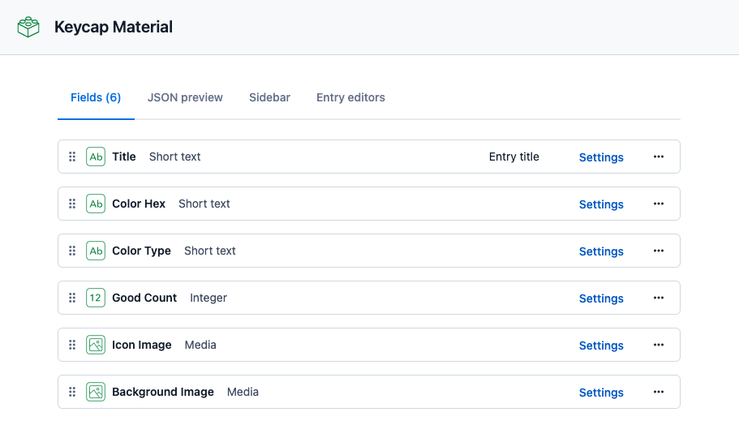

# sustainable-keycap

廃プラを使ったキーキャップの作り方をオープンソースで広げていくコミュニティです

## 開発環境の構築について

開発時のアプリケーション起動には以下の 3 つのコマンドが使用できます。

| コマンド                 | 説明                                                                                                                                                                                      |
| ------------------------ | ----------------------------------------------------------------------------------------------------------------------------------------------------------------------------------------- |
| `yarn dev`               | `next dev` でローカル上でアプリケーションを実行します。 Contentful への接続情報が必要です。ローカルの環境変数で指定してください。                                                      |
| `yarn dev:no-contentful` | `next dev` でローカル上でアプリケーションを実行します。 Contentful への接続は行わず、Contenful から得るはずだったデータは`lib/helper.ts`で定義したサンプルデータを代わりに使用します。 |
| `yarn dev:vercel`        | `vercel dev` でローカル上でアプリケーションを実行します。 Contentful への接続情報が必要です。 ローカルの環境変数、もしくは Vercel のプロジェクト設定で指定してください。            |

Contentful への接続情報の設定については [Contentful 接続情報の設定について](#Contentful接続情報の設定について) を参照してください。

## デプロイについて

デプロイ環境として Vercel を使用することを想定しています。（事前にリポジトリと Vercel を連携させておく必要があります）

Vercel の機能として、ブランチを GitHub に Push するたびに自動でプレビュー環境がデプロイされます。（デフォルトでは、`main`ブランチへの Push によって本番環境へのデプロイが行われます）

また、以下のコマンドを使用することで手動でのデプロイが可能です。
| コマンド | 説明 |
| ---- | ---- |
| `yarn deploy:dev` | Vercel のプレビュー環境にデプロイします。 |
| `yarn deploy:prod` | Vercel の本番環境にデプロイします。 本番環境に影響を与えます。実行時は注意してください。 |

## Contentful 接続情報の設定について

このアプリケーションは素材データを Contentful から取得することを想定しています。  
接続のために必要な情報は環境変数に設定してください。必要な値は以下の通りです。

| 環境変数                         | 説明                                                                                    |
| -------------------------------- | --------------------------------------------------------------------------------------- |
| `KEYCAP_CONTENTFUL_SPACE_ID`     | 素材データを管理している Space の ID                                                    |
| `KEYCAP_CONTENTFUL_ACCESS_TOKEN` | 素材データを管理している Space で Content Delivery API を使用するためのアクセストークン |
| `KEYCAP_CONTENTFUL_CONTENT_TYPE` | 素材データの Content Model の ID                                                        |

環境変数を設定する方法はアプリケーションの実行環境によって異なります。

| 環境                              | 設定方法                                                                                                                                                                                |
| --------------------------------- | --------------------------------------------------------------------------------------------------------------------------------------------------------------------------------------- |
| `yarn dev`                        | - 使用しているシェルや IDE の設定で環境変数を追加  - リポジトリ直下に`.env`を作成し、その中に環境変数を記述                                                                          |
| `yarn dev:no-contentful`          | Contentful を使用しないので環境変数の設定は不要です                                                                                                                                     |
| `yarn dev:vercel`                 | - 使用しているシェルや IDE の設定で環境変数を追加   - リポジトリ直下に`.env`を作成し、その中に環境変数を記述   - Vercel 上のプロジェクト設定で `Development` 向けに環境変数を設定 |
| Vercel 上で実行（プレビュー環境） | Vercel のプロジェクト設定で `Preview` 向けに環境変数を設定                                                                                                                              |
| Vercel 上で実行（本番環境）       | Vercel のプロジェクト設定で `Production` 向けに環境変数を設定                                                                                                                           |

## Contentful の Content model について

Conteful 上で素材データを管理するモデルの定義は以下を想定しています。

| Name             | Field ID  | Validation                                                                                    |
| ---------------- | --------- | --------------------------------------------------------------------------------------------- | ------------------ |
| Title            | title     | - Required field                                                                              |
| Color Hex        | colorHex  | - Required field   - Match a specific pattern (`^#([A-Fa-f0-9]{6}                          | [A-Fa-f0-9]{3})$`) |
| Color Type       | colorType | - Required field   - Accept only specified values ( `red / blue / green / black / white` ) |
| Good Count       | goodCount | - Required field   - Accept only specified number range ( `Greater or equal than 0` )      |
| Icon Image       | iconImage |                                                                                               |
| Background Image | bgImage   |                                                                                               |
